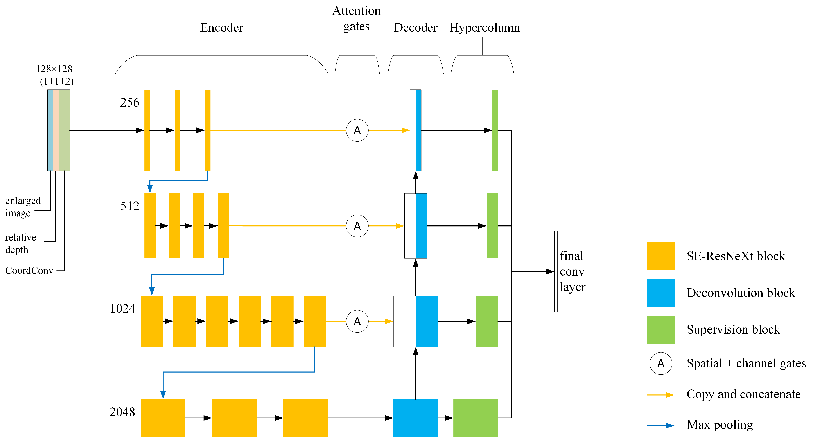

# U-Net with ResNet and ResNext Encoder Pre-Trained on ImageNet with HyperColumns, ChannelAttention, SpatialAttentionGate for Image Segmentation

By [Mikhail Karchevskiy](https://www.linkedin.com/in/mikhail-karchevskiy-aa46245a/), [Insaf Ashrapov](https://www.linkedin.com/in/iashrapov/) and [Leonid Kozinkin](https://www.linkedin.com/in/lkozinkin/)

Based on [TernausNet](https://github.com/ternaus/TernausNet).

# Introduction

One of the most important applications of seismic reflection is the hydrocarbon exploration which is closely related to salt deposits analysis. This problem is very important even nowadays due to it’s non-linear nature. Taking into account the recent developments in deep learning networks [TGS-NOPEC Geophysical Company](https://www.tgs.com/) hosted the Kaggle [competition](https://www.kaggle.com/c/tgs-salt-identification-challenge) for salt deposits segmentation problem in seismic image data. In this paper, we demonstrate the great performance of several novel deep learning techniques merged into a single neural network. Using a [U-Net](https://arxiv.org/abs/1505.04597) with [ResNeXt-50](https://arxiv.org/abs/1611.05431) encoder pretrained on [ImageNet](http://www.image-net.org/) as our base architecture, we implemented [Spatial-Channel Squeeze & Excitation](https://arxiv.org/abs/1803.02579), [Lovasz loss](https://github.com/bermanmaxim/LovaszSoftmax), analog of [CoordConv](https://eng.uber.com/coordconv/) and [Hypercolumn](https://arxiv.org/abs/1411.5752) methods.

This architecture was a part of the [solutiuon](https://www.kaggle.com/c/tgs-salt-identification-challenge/discussion/69274) (27th out of 3234 teams top 1%) in the [TGS Salt Identification Challenge](https://www.kaggle.com/c/tgs-salt-identification-challenge).

# Model architecture



# Citing
Please cite in your publications if it helps your research:

```
@ARTICLE{arXiv:1812.01429,
         author = {Mikhail Karchevskiy, Insaf Ashrapov, Leonid Kozinkin},
          title = {Automatic salt deposits segmentation: A deep learning approach},
        journal = {ArXiv e-prints},
         eprint = {1812.01429},
           year = 2018
        }
```